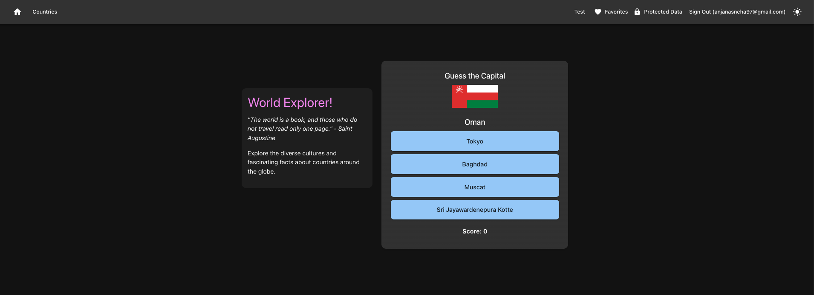
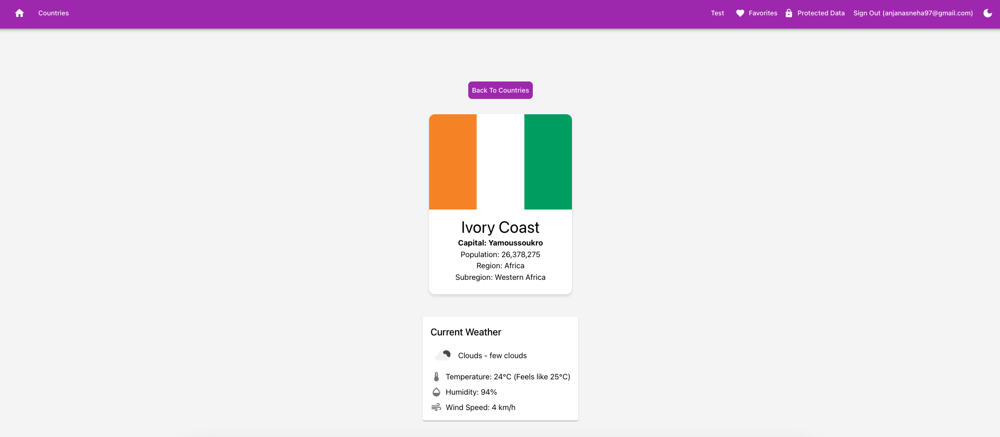

# World Explorer!

A full-stack application with NestJS backend and React frontend.
This website is for curious explorers and want to know more about countries of the world. User can explore basic information about each country and weather in the capital city.



## Project Structure

```shell
project-root/
├── backend/   # NestJS application
└── frontend/  # React application
```

## Prerequisites

- Node.js (v18 or higher recommended)
- npm (comes with Node.js)

## Development

1. Clone this repository

   ```bash
   git clone https://github.com/SneRam-0105/Countries-app.git
   cd Countries-app
   ```

2. install the dependencies using the commands below:

   ```bash
   npm install
   cd frontend
   npm install
   cd ..\backend
   npm install
   ```

3. Start both frontend and backend development servers(from the root folder in the repository):

   ```bash
   npm run dev
   ```

The applications will be available at:

- Frontend: http://localhost:5180
- Backend: http://localhost:3000

### Available Commands

- `npm run dev` - Start both frontend and backend in development mode
- `npm run dev:frontend` - Start only the frontend
- `npm run dev:backend` - Start only the backend
- `npm run install:all` - Install dependencies for both projects
- `npm run install:frontend` - Install frontend dependencies
- `npm run install:backend` - Install backend dependencies
- `npm run build` - Build both projects
- `npm run build:frontend` - Build frontend only
- `npm run build:backend` - Build backend only

## Environment Setup

1. Create a `.env` file in the backend directory:

```env
SUPABASE_URL=https://your-supabase-instance.supabase.co
SUPABASE_ANON_KEY=your-anon-key
```

## Tech Stack

- **Frontend:**
  - React
  - TypeScript
  - Vite
- **Backend:**

  - NestJS
  - TypeScript
  - Supabase

- ## Setup and usage

Live page [here] https://github.com/SneRam-0105/Countries-app

## Other Screenshots

Light Mode


## Authors and acknowledgment

A big thanks to Martin for guiding us and teaching new concepts throughout the project.

- GitHub https://github.com/martin-holland/Countries-Fullstack
- Weather data from - https://openweathermap.org/api

## Future Enhancements

- I would like to continue building this website for explorers who could plan their next adventure with all the top things to do in the country and with much more details attached to each country.

- I would also like to deploy my app so it is easy accesible for the users.
